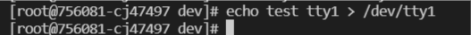
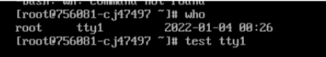

# devops_terminal-2

1. Это встроенная команда оболочки (на уровне ядра Linux). Данная команда требуется для работы с папками.
Можно сделать CD внешней программой, но после смены директории необходимо вызвать bash из этого (нового каталога), но тогда мы получим новый shell.
И выходя из сессии придется выходить, опять же, из всех сессий, которые создали при каждом вызове внешней CD.
   
2. 
```
    vagrant@vagrant:~$ cat tst_bash
    if [[ -d /tmp ]];
    sdgsdfgfd
    sdgsdfgfghdgfd
    123
    vagrant@vagrant:~$ grep 123 tst_bash -c
    1
    vagrant@vagrant:~$ grep 123 tst_bash |wc -l
    1
```
3. 
На виртуальной машине - systemd:
```
at@srv01:~$ pstree -p
systemd(1)─┬─ModemManager(782)─┬─{ModemManager}(832)
           │                   └─{ModemManager}(846)
           ├─NetworkManager(816)─┬─{NetworkManager}(868)
           │                     ├─{NetworkManager}(869)
           │                     └─{NetworkManager}(21165)
           ├─VBoxSVC(963)─┬─{VBoxSVC}(1014)
           │              ├─{VBoxSVC}(1015)
```
4.
```
открываем терминал 5
vagrant@vagrant:~$ tty
/dev/pts/5
перенаправляем ошибку на терминал 4, пытаясь открыть несуществующую директорию
 ls -l \test 2>/dev/pts/4

получаем на терминале 4 сообщение
vagrant@vagrant:~$ cat 4
ls: cannot access 'test': No such file or directory
```
5.
```
Просматриваем содержимое тестового файла
vagrant@vagrant:~$ cat test_in
line 1: 123
line 2: 12345
line 3: 1234567
Передаем в вывод содержимого на экран в файл вывода (ответ на вопрос)
cat <test_file >test_out
Вывод содержимого файла out
vagrant@vagrant:~$  cat test_file_out
line 1: 123
line 2: 12345
line 3: 1234567
```
6. Открываем терминал на vps
```
[root@756081-cj47497 dev]# who
root     pts/7        2022-01-04 00:22 (176.52.112.151)
```
открываем консоль на панели управления (web консоль), получили tty1 

Отправляем сообщение терминала pts/7:


Получаем на tty1 консоли


7.
```
В рамках текущей терминальной сессии создать дескриптор 5 и перенаправит в stout
vagrant@vagrant:~$   bash 5>&1
vagrant@vagrant:~$  echo netology > /proc/$$/fd/5
netology
Для текущей сессии выведет сообщение по 5-му дескриптору. Дескриптор привязан только к конкретной терминальной сессии (номер файла в $$)
```
8. 
```
vagrant@vagrant:~$ ls -l /root 9>&2 2>&1 1>&9 |grep denied -c 
1

9>&2 - новый дескриптор перенаправили в stderr
2>&1 - stderr перенаправили в stdout 
1>&9 - stdout - перенаправили в в новый дескриптор
```
9. Будут выведены переменные окружения:
```
at@srv01:~$ cat /proc/$$/environ
LANG=en_US.UTF-8USER=atLOGNAME=atHOME=/home/atPATH=/usr/local/sbin:/usr/local/bin:/usr/sbin:/usr/bin:/sbin:/bin:/usr/games:/usr/local/gamesSHELL=/bin/bashTERM=xterm-256colorXDG_SESSION_ID=276XDG_RUNTIME_DIR=/run/user/1000DBUS_SESSION_BUS_ADDRESS=unix:path=/run/user/1000/busXDG_SESSION_TYPE=ttyXDG_SESSION_CLASS=userMOTD_SHOWN=pamSSH_CLIENT=192.168.255.4 49494 22SSH_CONNECTION=192.168.255.4 49494 192.168.87.252 22SSH_TTY=/dev/pts/0at@srv01:~$
```
можно получить то же самое (только с разделением по переменным по строкам):
printenv
env
10. /proc/<PID>/cmdline - полный путь до исполняемого файла процесса [PID]  (строка 231)

/proc/<PID>/exe - содержит ссылку до файла запущенного для процесса [PID], 
cat выведет содержимое запущенного файла, 
запуск этого файла, запустит еще одну копию самого файла (строка 285)
11. 
SSE 4.2
```
vagrant@vagrant:~$ grep sse /proc/cpuinfo
```
12. При открытии ssh сессии по умолчанию создается pts, соответственно, не открывается tty. можно его принудительно привязать через опцию -t.
13. Притягиваем screen процесс в текущий терминал:
    ```
    top
    vagrant@vagrant:~$ reptyr -s 3185
    ```
14. tee - read from standard input and write to standard output and files
tee выводит и в stdout и в файл


